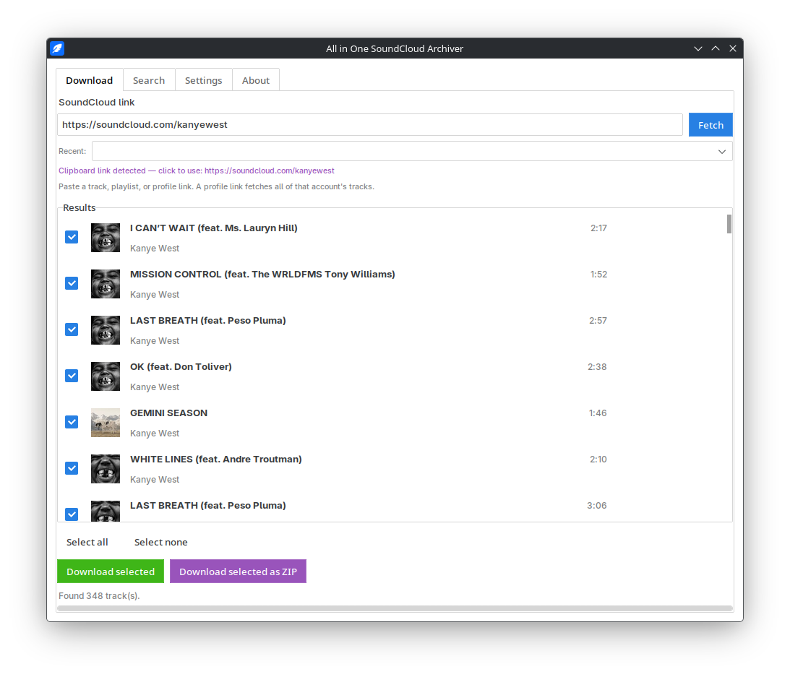
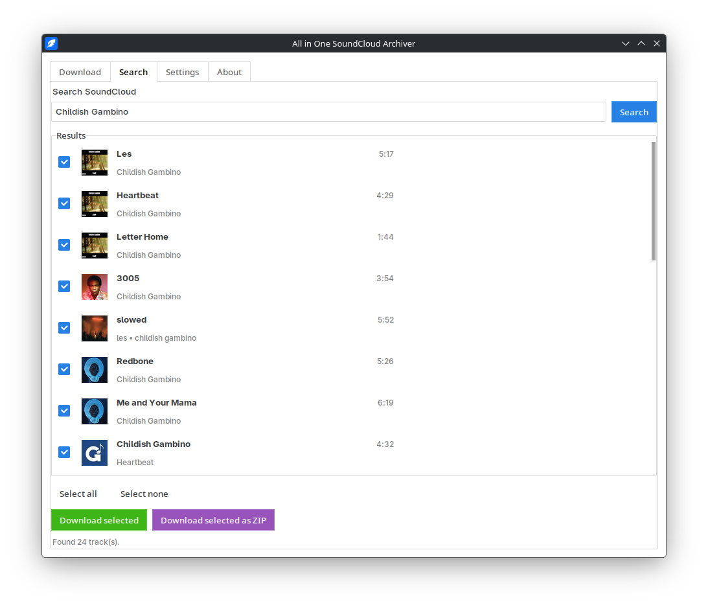
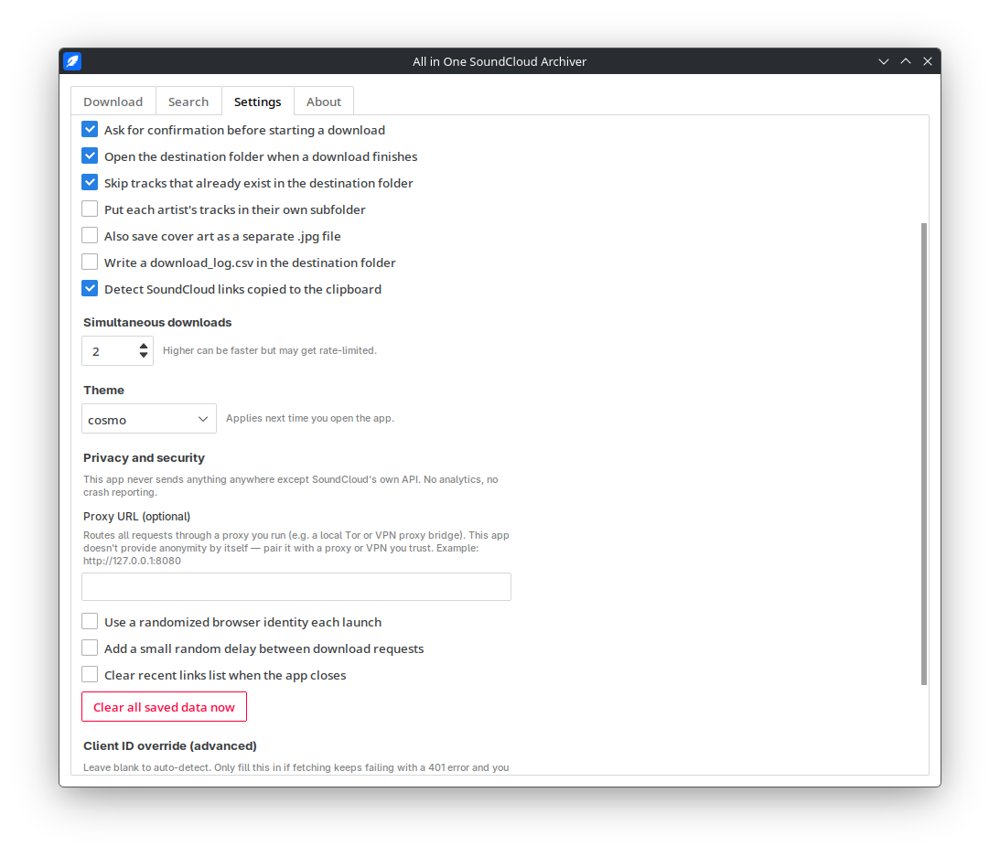

# All in One SoundCloud Archiver

A desktop app for downloading tracks, playlists, or an entire profile's
uploads from SoundCloud, one at a time or bundled into a ZIP. Also supports
searching SoundCloud directly by keyword.

Project by SandwichVertigo: https://github.com/SandwichVertigo/

## Not affiliated with SoundCloud

This is an independent, third-party project. It is not affiliated with,
endorsed by, sponsored by, or officially connected to SoundCloud Limited or
any of its affiliates in any way. "SoundCloud" is used here only to
describe the service this app interacts with. Any trademarks referenced
belong to their respective owners.

## Use at your own risk

Only download content you own, content the creator has explicitly marked as
downloadable, or content licensed for personal use (Creative Commons, etc).
Downloading copyrighted material without permission may violate SoundCloud's
Terms of Service and copyright law where you live. You are solely
responsible for how you use this software. It is provided as-is, with no
warranty, and the author is not liable for any misuse or consequences of
using it.

## Screenshots





## Setup

1. Install Python 3.10 or newer.
2. Install FFmpeg and make sure it is on your system PATH (needed to save
   tracks as MP3). See the distro-specific instructions below.
3. Install the Python dependencies:

   ```
   pip install -r requirements.txt
   ```

4. Run the app:

   ```
   python main.py
   ```

If you previously used this app under its old name ("SoundCloud Grabber"),
your saved settings are copied over automatically on first launch.

### Ubuntu / Debian / Linux Mint / Pop!_OS

```bash
sudo apt update
sudo apt install python3 python3-pip python3-venv python3-tk ffmpeg
cd AllInOneSoundCloudArchiver
python3 -m venv venv
source venv/bin/activate
pip install -r requirements.txt
python main.py
```

### Fedora / Nobara

```bash
sudo dnf install python3 python3-pip python3-tkinter ffmpeg
cd AllInOneSoundCloudArchiver
python3 -m venv venv
source venv/bin/activate
pip install -r requirements.txt
python main.py
```

FFmpeg may need the RPM Fusion repository enabled first if it's not already
available: https://rpmfusion.org/Configuration

### Arch Linux / Manjaro / EndeavourOS

```bash
sudo pacman -S python python-pip tk ffmpeg
cd AllInOneSoundCloudArchiver
python -m venv venv
source venv/bin/activate
pip install -r requirements.txt
python main.py
```

### openSUSE

```bash
sudo zypper install python3 python3-pip python3-tk ffmpeg
cd AllInOneSoundCloudArchiver
python3 -m venv venv
source venv/bin/activate
pip install -r requirements.txt
python main.py
```

### Any other Linux distro

The dependencies you need from your package manager are: Python 3.10+,
pip, the Tk/Tkinter bindings for Python (sometimes a separate package from
Python itself), and FFmpeg. Once those are installed, the venv and pip
steps above are the same everywhere:

```bash
cd AllInOneSoundCloudArchiver
python3 -m venv venv
source venv/bin/activate
pip install -r requirements.txt
python main.py
```

### macOS

```bash
brew install python ffmpeg
cd AllInOneSoundCloudArchiver
python3 -m venv venv
source venv/bin/activate
pip install -r requirements.txt
python main.py
```

### Windows

1. Install Python from python.org (check "Add python.exe to PATH" during
   install - Tkinter is included by default on Windows).
2. Download an FFmpeg build from ffmpeg.org, unzip it, and add its `bin`
   folder to your PATH.
3. Then, in Command Prompt or PowerShell:

   ```
   cd AllInOneSoundCloudArchiver
   python -m venv venv
   venv\Scripts\activate
   pip install -r requirements.txt
   python main.py
   ```

## Features

- **Download tab** - paste a track, playlist, or profile link and fetch it.
  A profile link pulls in that account's public uploads.
- **Search tab** - search SoundCloud by keyword instead of pasting a link.
- **Recent links** - a dropdown of your last few fetched links.
- **Clipboard detection** - if a SoundCloud link is on your clipboard, a
  clickable hint appears so you can drop it into the URL field in one click.
- **Bulk or individual downloads** - download selected tracks straight into
  a folder, or bundle them into a ZIP you choose the location for.
- **Concurrent downloads** - download several tracks at once (adjustable in
  Settings) instead of one at a time.
- **Cancel mid-download** - stop a batch partway through.
- **Retry failed** - after a batch finishes, retry just the tracks that
  failed instead of starting over.
- **Skip existing files** - won't re-download a track that's already in the
  destination folder (can be turned off in Settings).
- **Cover art and tags** - every MP3 is saved with title/artist/album ID3
  tags and embedded cover art automatically. Optionally also save the cover
  art as a separate .jpg file.
- **Per-artist subfolders** - optionally organize bulk downloads into a
  folder per artist.
- **Custom filename pattern** - control how files are named using
  `{artist}`, `{title}`, `{album}`, and `{track_no}`
- **Download log** - optionally write a `download_log.csv` recording what
  was downloaded, skipped, or failed, and when.
- **Faster startup** - the SoundCloud client id is cached to disk after the
  first successful fetch, so later launches don't need to re-scrape it.
- **Manual client id override** - if auto-detection ever fails, you can
  paste in a known-good client id and test the connection from Settings.
- **Light theme picker** - choose between several clean, light ttkbootstrap
  themes.
- **Window size memory** - the app reopens at the size and position you
  left it at.

## Privacy and security

- **No telemetry** - this app never sends anything anywhere except
  SoundCloud's own public API. No analytics, no crash reporting, nothing
  sent to the developer or anyone else.
- **Proxy support** - you can set an HTTP/HTTPS proxy URL in Settings and
  every request the app makes will route through it. This is meant to let
  you use a VPN, proxy, or local Tor bridge you already run and trust - the
  app itself has no built-in anonymization and doesn't claim to hide your
  network identity on its own.
- **Randomized browser identity** - optionally has the app present as a
  randomly chosen common browser on each launch, rather than always
  identifying itself the same way.
- **Request pacing** - optionally adds a small random delay between
  download requests, mainly to avoid tripping SoundCloud's bot detection
  during large batches.
- **Local data lockdown** - the settings file (which stores things like
  your recent links and download folder) is saved with owner-only
  permissions on Linux/macOS.
- **Clear all saved data** - a button in Settings wipes your saved
  settings, cached client id, and recent links in one click.
- **Clear recent links on exit** - an optional toggle to not keep a link
  history between sessions at all.
- **Secure temp handling** - when building a ZIP, tracks are staged in a
  private, owner-only-permission system temp directory rather than a named
  folder next to your chosen ZIP location, and that temp directory is
  cleaned up afterward.

## How it works

- Paste a link (or use Search) and click Fetch / Search.
- Check the tracks you want, then either:
  - **Download selected** - pick a folder, each track saves as an MP3.
  - **Download selected as ZIP** - pick where the ZIP file is saved, all
    selected tracks are bundled into it.
- Each row shows its live status (downloading / done / failed / skipped)
  during a batch.
- If some tracks fail, a **Retry failed** button appears after the batch
  finishes so you can retry just those.

## Notes

- SoundCloud can change how it serves data at any time, which may break
  fetching or downloading until this app is updated.
- Very large profiles or playlists can take a while to fetch and download.
- Raising "Simultaneous downloads" too high in Settings may get you
  temporarily rate-limited by SoundCloud - 2-3 is a reasonable default.
- Turning on request pacing will slow down large batches somewhat, since it
  intentionally adds delay between requests.

## Packaging as a standalone executable (optional)

If you want a single .exe/.app instead of running with Python directly,
PyInstaller works well:

```
pip install pyinstaller
pyinstaller --noconfirm --windowed --name "All in One SoundCloud Archiver" main.py
```

The built app will be in the `dist` folder.
